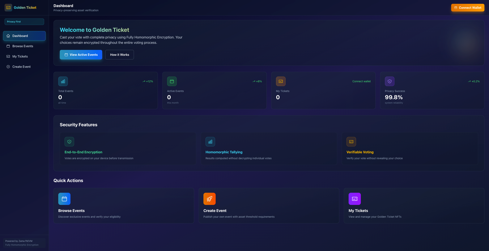

# 🎫 Golden Ticket - FHE-Powered Private Asset Verification

<div align="center">


**Privacy-Preserving Asset Verification using Fully Homomorphic Encryption**

---

### 📖 Read this in other languages

[](./README.md)
[](./README.zh.md)
[](./README.fr.md)

---

[Live Demo](https://golden-ticket-beryl.vercel.app/) | [Documentation](./frontend/README.md) | [Contracts](./backend/contracts)

</div>

---

## 📸 Screenshots

<div align="center">

### Landing Page


### DApp Dashboard


</div>

---

## 📖 Overview

**Golden Ticket** is an innovative decentralized application (DApp) that leverages **Zama's fhEVM** (Fully Homomorphic Encryption Virtual Machine) to enable **privacy-preserving asset verification**.

### 🎯 The Problem

Traditional blockchain applications require users to expose their wallet balances to prove eligibility for exclusive events, services, or communities. This creates privacy concerns for high-net-worth individuals.

### ✨ Our Solution

Golden Ticket allows users to **prove they meet asset requirements without revealing their actual balance** using Fully Homomorphic Encryption (FHE). The smart contract only learns whether the user qualifies - never the exact amount.

### 💡 Use Cases

- 🎉 **VIP Events**: Verify eligibility for exclusive conferences and parties
- 🖼️ **Private Auctions**: Access high-value NFT and asset auctions
- 🏛️ **DAO Membership**: Join private communities with asset-based requirements
- 🚀 **Early Access**: Get priority access to investment opportunities

---

## 🏗️ Architecture

```
┌─────────────────────────────────────────────────────────────┐
│                     Frontend (Next.js)                       │
│  • RainbowKit Wallet Connection                              │
│  • FHE Encryption (fhevmjs)                                  │
│  • Beautiful UI/UX                                           │
└────────────────────┬────────────────────────────────────────┘
                     │
        ┌────────────┴────────────┬───────────────┐
        ▼                         ▼               ▼
┌──────────────┐       ┌──────────────────┐   ┌──────────┐
│ EventManager │       │ Verification     │   │ NFT      │
│              │◄──────┤ (FHE Logic)      │──►│ Ticket   │
│ • Create     │       │ • Encrypt        │   │ • Mint   │
│ • Manage     │       │ • Verify         │   │ • QR Code│
└──────────────┘       └──────────────────┘   └──────────┘
```

### Smart Contracts (Sepolia Testnet)

| Contract | Address | Purpose |
|----------|---------|---------|
| **EventManager** | `0x7DE2ff3AEf56CE5a6cF3889Ed0173Bbd7C7a004B` | Manage events and thresholds |
| **GoldenTicketVerification** | `0x4472Be950F6a4c1c3E20D3D7A5c1B63b13a352f1` | FHE verification logic |
| **GoldenTicketNFT** | `0x56F581a07fFfEA6E8acD5357fDf0beCecB848EB2` | NFT tickets with QR codes |

---

## 🚀 Deploy to Vercel

Deploy your own instance of Golden Ticket with one click:

<div align="center">

[](https://vercel.com/new/clone?repository-url=https://github.com/huaguihai/golden-ticket&project-name=golden-ticket&repository-name=golden-ticket&root-directory=frontend/packages/nextjs)

**Quick deployment in under 5 minutes! No configuration required.**

</div>

> 💡 **Note**: The app will work with public RPC endpoints. For production use, add your own RPC provider keys in Vercel environment variables.

For detailed deployment instructions, see [DEPLOY_TO_VERCEL.md](./DEPLOY_TO_VERCEL.md).

---

## 🚀 Quick Start

### Prerequisites

- Node.js v18+
- pnpm package manager
- MetaMask wallet
- Sepolia testnet ETH ([Get from faucet](https://sepoliafaucet.com/))

### Installation

```bash
# Clone the repository
git clone https://github.com/huaguihai/golden-ticket.git
cd golden-ticket

# Install frontend dependencies
cd frontend
pnpm install

# Start development server
cd packages/nextjs
pnpm dev
```

Visit `http://localhost:3000` to see the app!

### Backend Setup (Optional - for contract development)

```bash
cd backend
npm install

# Run tests
npx hardhat test

# Deploy to Sepolia
npx hardhat run scripts/deploy.js --network sepolia
```

---

## 📂 Project Structure

```
golden-ticket/
├── frontend/              # Next.js frontend application
│   ├── packages/nextjs/
│   │   ├── app/          # App routes
│   │   ├── components/   # React components
│   │   ├── services/     # FHE encryption service
│   │   └── contracts/    # Contract ABIs
│   └── README.md         # Detailed frontend docs
│
├── backend/              # Smart contracts
│   ├── contracts/
│   │   ├── EventManager.sol
│   │   ├── GoldenTicketVerification.sol
│   │   └── GoldenTicketNFT.sol
│   ├── test/            # Contract tests
│   └── scripts/         # Deployment scripts
│
├── .gitignore
├── LICENSE
└── README.md            # This file
```

---

## 💻 Technology Stack

### Frontend
- **Framework**: Next.js 15.2.5
- **Styling**: Tailwind CSS
- **Web3**: RainbowKit, wagmi v2, viem, ethers.js
- **FHE**: fhevmjs

### Smart Contracts
- **Language**: Solidity ^0.8.24
- **Framework**: Hardhat
- **FHE Library**: @fhevm/solidity
- **Standards**: ERC721

### Infrastructure
- **Blockchain**: Ethereum Sepolia Testnet
- **FHE Service**: Zama Gateway
- **Privacy**: Fully Homomorphic Encryption

---

## 🔐 How It Works

### Traditional Approach ❌
```
User sends actual balance (0.05 ETH) → Contract sees 0.05 ETH
⚠️ Privacy violated - balance exposed on-chain
```

### Golden Ticket Approach ✅
```
User encrypts balance → Contract receives encrypted data
→ FHE comparison (encrypted >= threshold)
→ Oracle decrypts result → Only returns "qualified" or "not qualified"
✨ Privacy preserved - actual balance never revealed
```

---

## 🧪 Testing

```bash
# Run smart contract tests
cd backend
npx hardhat test

# Expected output: All tests passing ✓
```

---

## 🌟 Features

- ✅ **Privacy-First**: FHE ensures your balance stays encrypted
- ✅ **Auto-Detection**: Automatically detects wallet balance
- ✅ **NFT Tickets**: Receive on-chain NFT proof with QR code
- ✅ **Beautiful UI**: Modern, responsive design
- ✅ **Multi-Event**: Support for multiple events with different thresholds

---

## 🛣️ Roadmap

- [ ] Mainnet deployment
- [ ] Support for ERC20 tokens
- [ ] Mobile app
- [ ] Event organizer dashboard
- [ ] NFT marketplace integration
- [ ] Multi-chain support

---

## 📚 Documentation

- [Frontend Documentation](./frontend/README.md) - Detailed frontend setup and usage
- [Smart Contract Tests](./backend/test/GoldenTicket.test.ts) - Test suite
- [Zama fhEVM Docs](https://docs.zama.ai/fhevm) - Official FHE documentation

---

## 🤝 Contributing

Contributions are welcome! Please feel free to submit a Pull Request.

1. Fork the repository
2. Create your feature branch (`git checkout -b feature/AmazingFeature`)
3. Commit your changes (`git commit -m 'Add some AmazingFeature'`)
4. Push to the branch (`git push origin feature/AmazingFeature`)
5. Open a Pull Request

See [CONTRIBUTING.md](./CONTRIBUTING.md) for more details.

---

## 📄 License

This project is licensed under the MIT License - see the [LICENSE](LICENSE) file for details.

---

## 👨‍💻 Author

**im0xmarco**

- Twitter: [@im0xmarco](https://x.com/im0xmarco)
- Built for the [Zama Developer Program](https://zama.ai/programs/developer-program)

---

## 🙏 Acknowledgments

- **Zama Team** - For pioneering FHE technology
- **Ethereum Community** - For the robust smart contract infrastructure
- **Open Source Contributors** - For the amazing tools and libraries

---

## ⚠️ Disclaimer

This project is currently deployed on Sepolia testnet and is intended for demonstration and educational purposes. Always audit smart contracts before mainnet deployment.

---

<div align="center">

**⭐ If you find this project helpful, please give it a star! ⭐**

Made with ❤️ using Zama fhEVM

</div>
